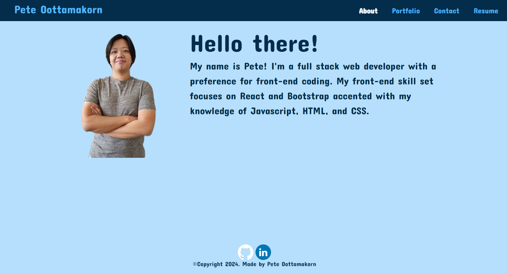
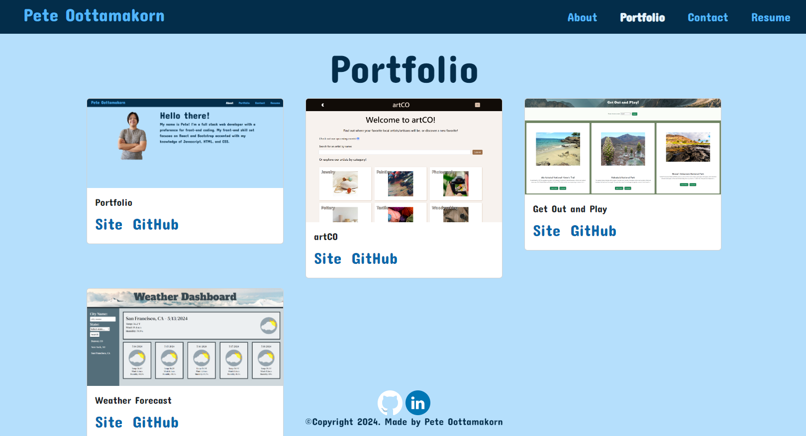
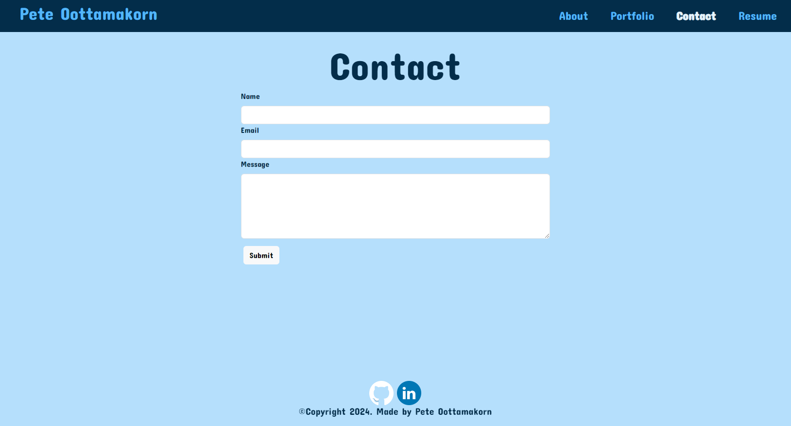
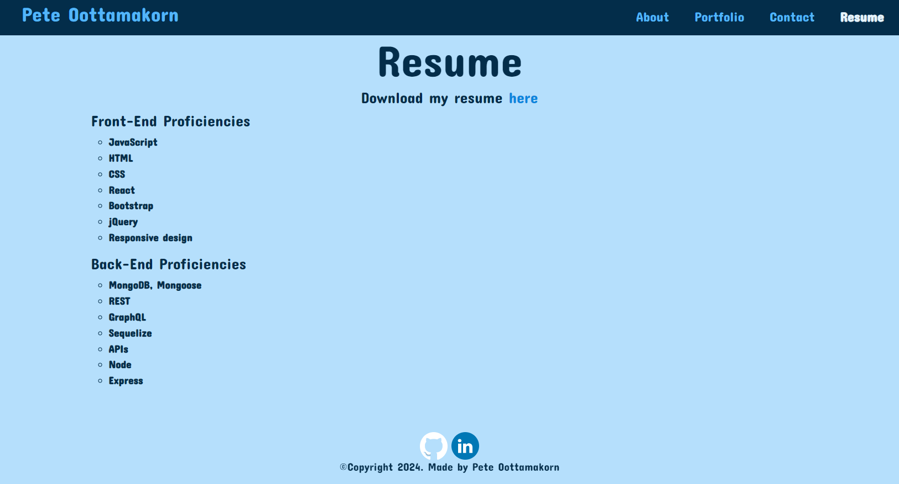

# Portfolio

## Description

This is a portfolio website to showcase my abilities as a web developer. This was created with the intention of finding work where I can leverage my abilities to the benefit of a client or employer.

## Table of Contents

[Installation](#installation)

[Usage](#usage)

[Contributing](#contributing)

[Tests](#tests)

[License](#license)

[Links](#links)

[Questions](#questions)

## Installation

This site is currently deployed via Netlify:

## Usage

You may navigate through the site using the navigation bar in the upper-right corner of the site.

The portfolio page will populate projects I have worked on and the deployed site can be reached by clicking on the 'Site' link(if available). The respective GitHub repository can be reached by clicking on the 'GitHub' link.

The contact page allows users to contact me via email by filling out the form provided and clicking on the 'Submit' button.

The resume page displays my programming knowledge and also provides a link to download a pdf of my resume. In the footer, you may reach my GitHub page and my LinkedIn page by clicking on the respective icons.

## Contributing

How to contribute to this project:

I will continue to update this repo with new projects I work on, as well as refining the look of the site. I would like to make the site behave more dynamically.

## Tests

All functionality was tested locally as the site was being built.

## License

The application is covered under the following license:

https://choosealicense.com/licenses/mit/

## Links

Netlify: https://peteoottamakorn.netlify.app/

Git Repo: https://github.com/PeteOottamakorn/pete-oottamakorn-portfolio

## Questions

If there are any questions, you may visit my GitHub page at
https://github.com/PeteOottamakorn

Or feel free to contact me at poottamakorn@gmail.com.
